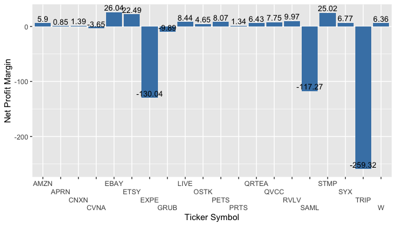

# finqreportr
A R package for downloading and displaying quarterly-report financial data from SEC's EDGAR database
Since its release,
[finreportr](https://github.com/sewardlee337/finreportr) has been a
handy package for financial analysts who use R for data analysis and
need to query financial reports of publicly traded companies from the
EDGAR database of U.S. Securities and Exchange Commission (SEC).
However, it still comes with two major drawbacks. First, it only allows
users to scrape annual reports from 10-K forms, not quarterly reports
from 10-Q forms. Second, its important dependent package
[XBRL](https://cran.r-project.org/web/packages/XBRL/index.html) for
pulling and parsing XBRL-encoded data has not been maintained and
updated for years, the bugs of this package has limited the
functionality of **finreportr** package. To try to handle the above
issues, **finqreportr** is created.

The purpose of **finqreportr** package is to create a R-based web
scraper that allows financial analysts to query quarterly-report
financial data from SEC EDGAR database. Like **finreportr**, the package
itself will not provide any functions for specific financial statement
analysis (except the example in package vignettes) but offers a
data-loading option for the analysts who need an one-stop workflow using
R: accessing, getting and analyzing financial data in only one
environment.

For now **finqreportr** is offering three functions that can fetch and
load quarterly-report data from the SEC EDGAR database:

-   `GetIncome()`: returns the quarterly income statement for a given
    company in a specific year
-   `GetBalanceSheet()`: returns the quarterly balance sheet for a given
    company in a specific year
-   `GetCashFlow()`: returns the quarterly cash flow statement for a
    given company in a specific year

Querying Financial Data
-----------------------

Like **finreportr**, the main benefit of **finqreportr** “comes from
allowing users to download and display financial data without having to
manually inspect filings from the SEC EDGAR database.” It also give
users more flexibility to “introduce automation, scalability, and
reproducibility to their analysis.”

The function `GetIncome()` returns a company’s quarterly income
statement from a given filing year. Here is the example to query income
statement of Tesla Motors (symbol: `TSLA`) from the quarterly report
filled in the 1st quarter of 2018:

``` r
library(finqreportr)
```

``` r
head(GetIncome("TSLA", 2018, "Q1"))
#>                                            Metric        Units     Amount  startDate    endDate
#> 1                         Sales Revenue Goods Net U_iso4217USD 2035060000 2017-01-01 2017-03-31
#> 2                         Sales Revenue Goods Net U_iso4217USD 2561881000 2018-01-01 2018-03-31
#> 3 Operating Leases Income Statement Lease Revenue U_iso4217USD  254540000 2017-01-01 2017-03-31
#> 4 Operating Leases Income Statement Lease Revenue U_iso4217USD  173436000 2018-01-01 2018-03-31
#> 5                        Sales Revenue Automotive U_iso4217USD 2289600000 2017-01-01 2017-03-31
#> 6                        Sales Revenue Automotive U_iso4217USD 2735317000 2018-01-01 2018-03-31
```

The function `GetBalanceSheet()` returns a company’s quarterly balance
sheet from a given filing year. Here is the example to query balance
sheet of Amazon (symbol: `AMZN`) from the quarterly report filled in the
2nd quarter of 2017:

``` r
head(GetBalanceSheet("AMZN", 2017, "Q2"))
#>                                         Metric Units     Amount startDate    endDate
#> 1 Cash and Cash Equivalents, at Carrying Value   usd 1.0269e+10      <NA> 2015-06-30
#> 2 Cash and Cash Equivalents, at Carrying Value   usd 1.5890e+10      <NA> 2015-12-31
#> 3 Cash and Cash Equivalents, at Carrying Value   usd 1.2470e+10      <NA> 2016-03-31
#> 4 Cash and Cash Equivalents, at Carrying Value   usd 1.2521e+10      <NA> 2016-06-30
#> 5 Cash and Cash Equivalents, at Carrying Value   usd 1.9334e+10      <NA> 2016-12-31
#> 6 Cash and Cash Equivalents, at Carrying Value   usd 1.5440e+10      <NA> 2017-03-31
```

The function `GetCashFlow()` returns a company’s quarterly cash flow
statement from a given filing year. Here is the example to query cash
flow statement of Netflix (symbol: `NFLX`) from the quarterly report
filled in the 3rd quarter of 2016:

``` r
head(GetCashFlow("NFLX", 2016, "Q3"))
#>                                     Metric Units     Amount  startDate    endDate
#> 1 Net Income (Loss) Attributable to Parent   usd   29432000 2015-07-01 2015-09-30
#> 2 Net Income (Loss) Attributable to Parent   usd   79463000 2015-01-01 2015-09-30
#> 3 Net Income (Loss) Attributable to Parent   usd   51517000 2016-07-01 2016-09-30
#> 4 Net Income (Loss) Attributable to Parent   usd  119930000 2016-01-01 2016-09-30
#> 5    Additions to Streaming Content Assets   usd 1304466000 2015-07-01 2015-09-30
#> 6    Additions to Streaming Content Assets   usd 4221326000 2015-01-01 2015-09-30
```

Case Study: Financial Ratios Calculation and Simple Statistical Analysis
------------------------------------------------------------------------

First, let’s create a list of stock symbols of 20 publicly traded
E-commerce Companies:

``` r
symbol_list <- c("AMZN", "APRN", "PRTS", "CVNA", "LIVE", "QRTEA", "QVCC",
                "EBAY", "ETSY", "EXPE", "GRUB", "RVLV", "OSTK",
                "CNXN", "SAML", "PETS", "SYX", "STMP","TRIP","W")
```

Then suppose we want to do some up-to-date financial analysis for these
companies, thus we need some quarterly statements filled in the 2nd
quarter of 2020. What we can do is to apply functions
`GetBalanceSheet()` and `GetIncome()` to each company in that list and
store the obtained statements(as data frames) in two separated list:

``` r
BS_list <- lapply(symbol_list, GetBalanceSheet, 2020, "Q2")
IS_list <- lapply(symbol_list, GetIncome, 2020, "Q2")
```

Next, we can calculate three important financial ratios: Current Ratio,
D/E Ratio, and Net Profit Margin. From one aspect, they may represent
the liquidity (Current Ratio), financial leverage (D/E Ratio), and
profitability (Net Profit Margin) of these companies in a given period
of time. The results are then stored as columns of a newly-created data
frame `ratio_df`:

``` r
library(scales)

GetCurrentRatio <- function(x) {
  currentRatio <- 
    x[x$Metric %in% c("Assets, Current", 
                       "Assets Current", 
                       "us-gaap_AssetsCurrent") & 
        grepl("2020-06", x$endDate, fixed = TRUE), ]$Amount /
    x[x$Metric %in% c("Liabilities, Current", 
                       "Liabilities Current", 
                       "us-gaap_LiabilitiesCurrent") &
        grepl("2020-06", x$endDate, fixed = TRUE), ]$Amount
  return(currentRatio)
}

GetDERatio <- function(x) {
  deRatio <- 
    (x[x$Metric %in% c("Liabilities and Equity", 
                       "Liabilities And Stockholders Equity", 
                       "us-gaap_LiabilitiesAndStockholdersEquity") & 
        grepl("2020-06", x$endDate, fixed = TRUE), ]$Amount - 
       x[x$Metric %in% c("Stockholders' Equity Attributable to Parent", 
                         "Stockholders Equity",
                         "Stockholders' deficiency",
                         "us-gaap_StockholdersEquity") & 
        grepl("2020-06", x$endDate, fixed = TRUE), ]$Amount)/
    x[x$Metric %in% c("Stockholders' Equity Attributable to Parent", 
                      "Stockholders Equity", 
                      "Stockholders' deficiency",
                      "us-gaap_StockholdersEquity") & 
        grepl("2020-06", x$endDate, fixed = TRUE), ]$Amount
  return(deRatio)
}

GetNetProfitMargin <- function(x) {
  npMargin <- 
    x[x$Metric %in% c("Net Income (Loss) Attributable to Parent", 
                      "Net Income Loss", 
                      "Net income",
                      "Comprehensive Income (Loss), Net of Tax, Attributable to Parent",
                      "Net Income Loss Available To Common Stockholders Basic") & 
        grepl("2020-06", x$endDate, fixed = TRUE) & 
        (grepl("2020-04", x$startDate, fixed = TRUE) |
           grepl("2020-03", x$startDate, fixed = TRUE)), ]$Amount /
    x[x$Metric %in% c("Revenues",
                      "Sales",
                      "Revenue, Net",
                      "Revenues from sales of products",
                      "Revenue From Contract With Customer Excluding Assessed Tax", 
                      "Revenue from Contract with Customer, Excluding Assessed Tax") &
        grepl("2020-06", x$endDate, fixed = TRUE) & 
        (grepl("2020-04", x$startDate, fixed = TRUE) |
           grepl("2020-03", x$startDate, fixed = TRUE)), ]$Amount
  return(npMargin)
}

currentRatio <- sapply(BS_list, GetCurrentRatio)
deRatio <- sapply(BS_list, GetDERatio)
npMargin <- unlist(sapply(IS_list, GetNetProfitMargin)) * 100

ratio_df <- data.frame(currentRatio, deRatio, npMargin)
names(ratio_df) <- c("Current Ratio", "D/E Ratio", "Net Profit Margin")
rownames(ratio_df) <- symbol_list
```

We can then obtain some basic descriptive statistics as shown in the
following table:

|                           | ratio\_df (N = 20) |
|:--------------------------|:-------------------|
| **Current Ratio**         |                    |
|    min                    | 0.24               |
|    median                 | 1.58               |
|    max                    | 4.66               |
|    mean ± sd              | 1.98 ± 1.23        |
| **D/E Ratio**             |                    |
|    min                    | -6.56              |
|    median                 | 1.95               |
|    max                    | 11.63              |
|    mean ± sd              | 2.19 ± 3.48        |
| **Net Profit Margin (%)** |                    |
|    min                    | -259.32            |
|    median                 | 6.13               |
|    max                    | 26.04              |
|    mean ± sd              | -18.93 ± 70.02     |

We can also create some plots to draw more insights from the data. Take
some basic bar plots for example:


